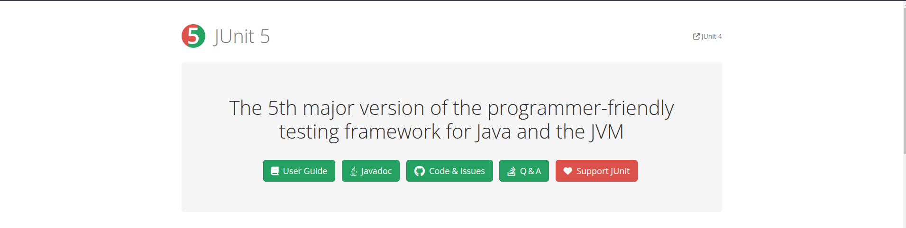
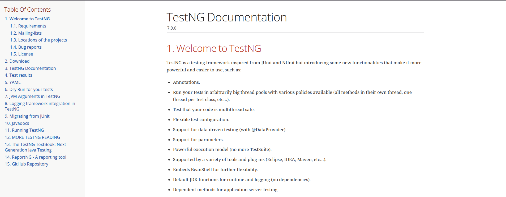
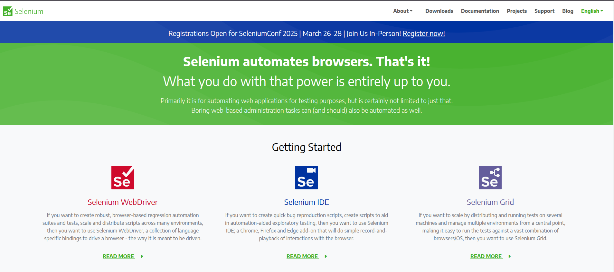
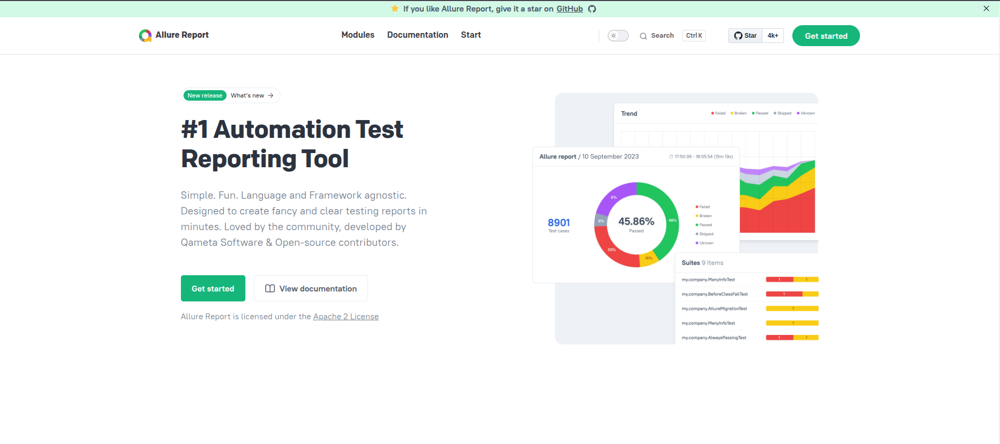

## The repository contains frameworks that I use for software testing:

---
### The repository is divided into modules:

###  [JUnit 5](https://junit.org/junit5/)

---

### [TestNG](https://testng.org/)

---

###  [Selenium](https://www.selenium.dev/)

---

###  [Allure](https://allurereport.org/)

---
### Contacts:
Email: Andrey.Vorobev.AQA@gmail.com