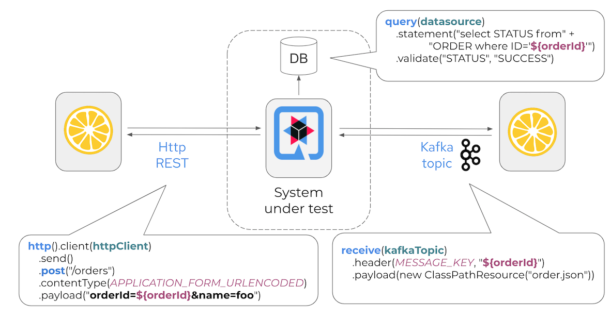

# [Citrus Integration Testing](https://citrusframework.org/)
### Framework for automated integration tests supporting a wide range of message protocols and data formats! Kafka, Http REST, JMS, TCP/IP, SOAP, FTP/SFTP, SSH, XML, Json and much more!

---


---
#### In a typical test scenario the system under test is running on a test infrastructure while interacting with Citrus over various messaging transports. During the test Citrus is able to act on both sides as client and consumer exchanging real request/response messages over the wire.
#### With each test step you can validate the exchanged messages with expected control data including message headers, attachments and body content (e.g. XML, Json, ...). The test provides a Java fluent API to specify the test logic and is fully automated. The repeatable test is nothing but a normal JUnit or TestNG test and can easily run as integration test in a CI/CD pipeline.

---
# Create citrus project 

```shell
 mvn archetype:generate
```